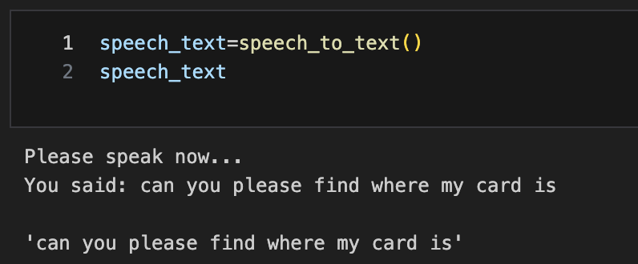
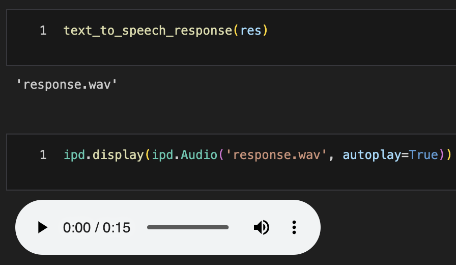

# CIS-600-NLP-Project
# CRED: A Chatbot for Credit Card Management

__[Github Repo](https://github.com/GvsSriRam/CIS-600-NLP-Project)__ - https://github.com/GvsSriRam/CIS-600-NLP-Project

## React Frontend

### Prerequisite:

- Node 20 or above version

### One Time Step:

- Navigate to the frontend folder using terminal
- use `npm i` to install all the dependencies

### Steps to run react frontend:

- use the command `npm start` in the terminal
- open your browser and navigate to http://localhost:3000/ to view open the web application

## Backend and AI
### Environment Setup

In order to run and test our project, a python environment. Follow the below instructions to build and setup the environment.

```sh
$ cd backend_and_ai
$ python -m venv nlp_env_project
$ source nlp_env_project/bin/activate
$ pip install --upgrade pip
$ pip install -r requirements.txt
$ python -m spacy download en_core_web_sm
$ brew install portaudio
$ brew install flac
```

## Start the API
Our backend API is built on FastAPI - Python and it is used to serve the frontend of this project. Upon starting the API, we load and setup the autocorrect, response generation modules and train the intent recognition model. 

```sh
$ python app.py
```

## Routes:
### Re-train intent classification model.
```
$ curl --location 'http://0.0.0.0:8000/nlp/train'
```
Response:
```json
{
    "success": true, // specifies the success state of trainnig
    "error": "" // error message if training fails
}
```
### Chat with model
```
$ curl --location 'http://0.0.0.0:8000/nlp/chat' \
--header 'Content-Type: application/json' \
--data '{
    "input": "Where is my card?"
}'
```
To chat with the model, we need to customize the "input" variable in the data.

Response:
```json
{
    "success": true,
    "result": {
        "input_str": "Where is my crd?", // user Query
        "autocorrect": true, // If autocorrect made any spell corrections
        "corrected_str": "where is my card", // Spell corrected query
        "intent": "card_arrival", // regognized intent
        "response": "Your card should arrive within 5-10 business days. If it hasn't arrived within this timeframe, please contact us.", // response for user
        "timestamp": "16:43" // time
    },
    "error": ""
}
```
We can also verify this on postman or any other service.

## Speech Integration
The API doesnot contain the speech, it is implemented in this [notebook](backend_and_ai/notebooks/speech_and_speech_to_text.ipynb).

Here's the sample outputs.

Speech to Text


Text to Speech

